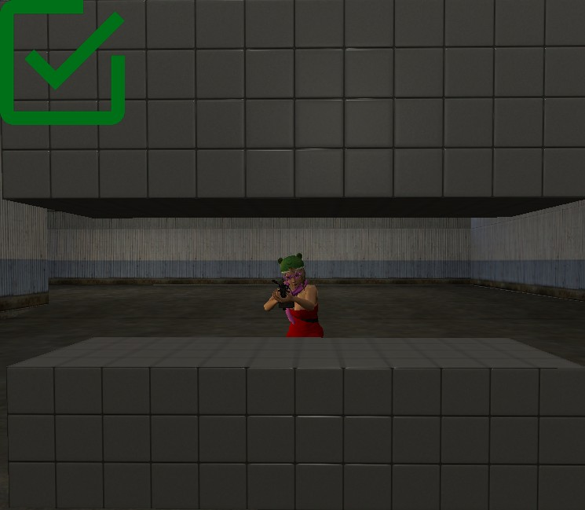
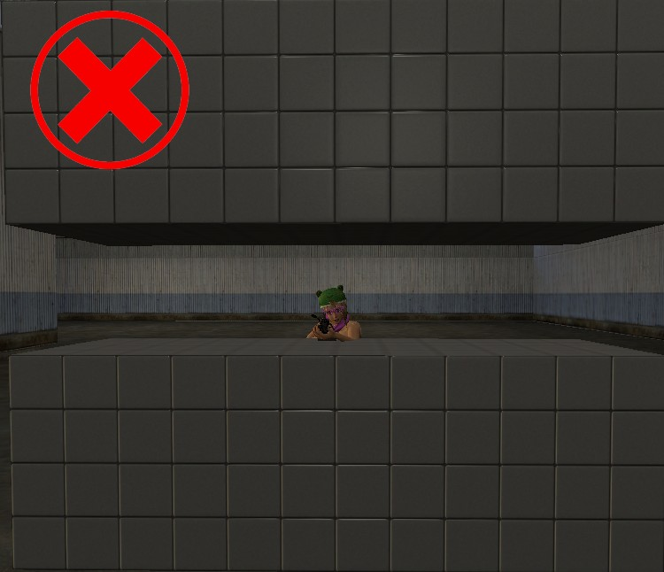

# 📄 Général

## :blue\_book: _<mark style="color:yellow;">**Les Bases**</mark>_ :blue\_book:

<mark style="color:purple;">**01**</mark> - Le **Freekill** : Tuer un joueur sans raison valable, vous devez prendre en compte qu'un meurtre est considéré comme <mark style="color:blue;">**dernière solution**</mark> dans une action.

<mark style="color:purple;">**02**</mark> - Le **Freeshoot** : Tirer sur une personne sans raison <mark style="color:blue;">**valable**</mark>.&#x20;

<mark style="color:purple;">**03**</mark> - Le **Teamkill** : Tirer ou tuer l'un de <mark style="color:blue;">**ses coéquipiers**</mark> ou une personne du <mark style="color:blue;">**même métier que vous**</mark>. Si vous avez besoin d'abattre un concurrent ou bien un ami faite appelle à un tueur à gages.

<mark style="color:purple;">**04**</mark> - Le **Freepunch** : Taper une personne sans raison <mark style="color:blue;">**valable**</mark>.

<mark style="color:purple;">**05**</mark> - Le **Freetaze** : Tazer une personne sans raison <mark style="color:blue;">**valable**</mark>.

<mark style="color:purple;">**06**</mark> - Le **FairPlay** : <mark style="color:blue;">**Respecter les règles du jeu,**</mark> <mark style="color:blue;">**ne pas ce donner tous les avantages et donner une chance au plus petit de pouvoir s'en sortir**</mark>. Le but d'une action n'est pas de se finir en quelques minutes, mais bien d'allonger celle-ci afin de prendre plus de plaisir et que votre Rp vous soit satisfait à la fin de chaque action.

<mark style="color:purple;">**07**</mark> - Le **Propskill** : Tuer une personne avec un props est <mark style="color:red;">**interdit**</mark>.

<mark style="color:purple;">**08**</mark> - Le **Propsclimb** : C'est le fait d'utiliser des <mark style="color:red;">**props pour monter à des endroits inaccessibles**</mark> normalement.

<mark style="color:purple;">**09**</mark> - Le **Propsblock** : C'est le fait d'utiliser des props pour <mark style="color:red;">**bloquer un accès existant**</mark> ou bien <mark style="color:red;">**une zone**</mark> <mark style="color:red;">**sans mettre de keypad ou un bouton.**</mark>

<mark style="color:purple;">**10**</mark> - Le **Powergaming** : C'est le fait de faire <mark style="color:blue;">**une action qui n'est pas réalisable**</mark> en temps normale (_ex : S'asseoir pour éviter les balles, sauter d'une falaise en voiture_)

<mark style="color:purple;">**11**</mark> - Le **MassRP** : C'est le fait de simuler la présence d'habitants et de civils partout en ville. Celle-ci n'est pas remplie **seulement de joueurs mais bien de milliers de citoyens.** (Le MassRP s'applique partout en ville, celle-ci est indiquée par des panneaux "Vous entrez en ville". Bien sûr, une action comme, par exemple, le **braquage de banque** est toujours possible.) Une personne en dehors de la zone de MassRP n'a pas le droit d'interagir avec une scène qui se passe dans la zone de MassRP. Si vous vous faites attaquer par des personnes autres que les forces de l'ordre, vous avez le droit de sortir votre arme pour vous défendre. Vous pouvez sortir vos armes pour une **action comme un braquage** **de banque**, une **prise d'otage** (**banque**), ou une **prise d'otage** (**en tant que dictateur**). À part ces deux situations, vous ne pouvez pas sortir votre arme pour une quelconque action RP. Les petites rues, par exemple, derrière la banque, derrière le concessionnaire, et derrière l'hôpital, sont comprises dans la zone du MassRP. Vous ne pouvez pas sortir votre arme pour effectuer une action RP.

<mark style="color:purple;">**12**</mark> - Le **Travers** : C'est le fait de tirer à travers une surface opaque telle que des murs ou bien des props. (il est cependant autorisé de tirer à travers les surfaces transparentes) (<mark style="color:red;">**Il est interdit de tirer à travers les vitres de la Banque et de l'ascenseur**</mark>)

<mark style="color:purple;">**13**</mark> - Le **NLR ( New Life Rule )** : C'est le fait de revenir sur une même position/action alors que vous êtes mort durant celle-ci. Ainsi que de vous souvenir de tout ce qu’il s’est passé avant votre mort.

<mark style="color:purple;">**14**</mark> - Le **Freedemote** : C'est le fait de démote (retirer le grade d’une personne) sans raison rp <mark style="color:blue;">**valable**</mark>.

<mark style="color:purple;">**15**</mark> - Le **Revenge Kill** : C'est le fait de tuer une personne qui vous a tué auparavant.

<mark style="color:purple;">**16**</mark> - Le **Trashtalk** : C'est le fait d'<mark style="color:blue;">**insulter ou de provoquer**</mark> quelqu'un après l'avoir tué (cela fonctionne aussi pour le chat).

<mark style="color:purple;">**17**</mark> - Le **Fear RP** : C'est le fait de <mark style="color:blue;">**simuler la peur**</mark> (_ex : Vous ne pouvez pas sortir d'arme quand vous êtes braqué_)

<mark style="color:purple;">**18**</mark> - Le **Pain RP** : C'est le fait de <mark style="color:blue;">**ressentir la douleur**</mark> infligé par une chute, après avoir reçu des balles, etc. Si vous êtes en incapacité physique de combattre (-15hp) vous ne pouvez donc pas engager / continuer un combat.

<mark style="color:purple;">**19**</mark> - Le **Metagaming** : C'est le fait de connaître des informations HRP sans les connaître dans un contexte RP (_ex : lire le nom d’une personne au-dessus de sa tête_)

<mark style="color:purple;">**20**</mark> - Le soundboard : C'est le fait d'<mark style="color:blue;">**utiliser des sons externes au serveur**</mark> (_ex : des musiques non incluses dans la boombox ou bien la radio dans les véhicules_)

<mark style="color:purple;">**21**</mark> - Le HRP vocal (Hors RP) : C'est le fait de <mark style="color:blue;">**parler d’information qui ne concerne en rien dans le Rp**</mark> (_ex : je vais faire un ticket contre toi, tu vas être ban …_)

<mark style="color:purple;">**22**</mark> - Le WIN RP : C'est le fait de se <mark style="color:blue;">**donner des avantages dans une action Rp**</mark> (_ex : tirer depuis un buisson, etc ..._ )

<mark style="color:purple;">**23**</mark> - Le ForceRP : C'est le fait de <mark style="color:blue;">**provoquer et forcer une action à se faire**</mark>  (_ex : insulter la police pour faire une course-poursuite puis une fusillade_)

<mark style="color:purple;">**24**</mark> - Le **Spawnkill** : C'est le fait de <mark style="color:blue;">**tuer des personnes au spawn ou venant d’y sortir**</mark>

<mark style="color:purple;">**25**</mark>** **<mark style="color:blue;">**-**</mark> Le **BunnyHop** est interdit : C'est le fait <mark style="color:blue;">**de ce déplacer en saut de manière continue afin de prendre de la vitesse ou d'esquiver les tires.**</mark>

<mark style="color:purple;">**26**</mark> - **Il est interdit de changer de métier lorsqu’une caisse spawn sur la map. Si cela permet de vous avantager afin de récupérer celle-ci**

\
:french\_bread: <mark style="color:yellow;">Règles Inclus sur le serveur</mark> :french\_bread:
-----------------------------------------------------------------------------------------------

<mark style="color:red;">**Il est formellement interdit de vendre ou de trade des armes permanentes à des prix qui ne respectent pas ceux du !vente In-Game ou dans la catégorie Communauté>Unbox sur le site.**</mark>

Interdiction de faire des activités illégales dans les endroits inaccessibles ou accessibles avec un grappin seulement

Pas de tirs sans sommations, et les boosts et grappins ne sont pas des armes

La police doit faire une course-poursuite pendant 5 minutes minimums avant de pouvoir tirer en cas de délit de fuite, sauf si les fuyards ouvrent le feu dans ce cas-là vous pourrez directement riposter

Lorsqu’un joueur lève les mains en l’air ça veut dire qu’il se rend donc vous devez l’arrêter ou le prendre en otage mais vous ne pouvez plus le tuer !

Les printers, les racks et les Bitminers sont illégals, le maire ne peut pas les rendre légaux

Les pubs sont interdites sur le serveur

Interdiction de braquer un vendeur d'arme pour éviter de payer

Il est impossible de vendre ou d’échanger de l’argent IG contre des avantages boutique (crédits, pack, etc….).

Vous n’avez pas le droit de vous redonner du kevlar ou de la vie (de quelconque manière) durant une action RP !

Vous n’avez pas le droit de construire durant une action.

Si vous voulez construire votre maison sans être braqué, vous devez mettre un textscreen au-dessus de la porte stipulant que vous êtes en construction, de ce fait vous n'aurez pas le droit de farm durant la période de construction (l'abus est interdit)

3 sommations orales claires et distinctes sont nécessaires avant de tuer une personne non-armée / armée&#x20;

Il est interdit de faire des sommations pour une autre personne (pour les personnes menottés ou braqués)

Vous ne pouvez en aucun cas vous procurer des objets et des armes pendant une action RP.

Les licences d’armes autorisent uniquement les armes de poing, mais interdisent de les utiliser sans raisons valables

La conduite de façon RP est obligatoire (En ville on roule à 50 hein)

Si vous vous baladez à pied, vous devez marcher sur le trottoir. (à part si vous ne pouvez pas).

Quand vous mourrez ou changez de job vous oubliez tout ce qu’il s’est passé avant.

Lorsqu'un véhicule blindé est à l'arrêt ou à une vitesse faible (moins de 10 km/h), vous êtes obligé de jouer votre fear RP.

Les propos racistes, xénophobes, homophobes, ou tout autre propos à caractère haineux est strictement interdit (pas de ramassage de savonnette)

Les insultes parentales / familiales sont formellement interdites (ainsi que les insultes à titre de dénigrement d'un genre)

Le /me assomme quelqu'un, ne fonctionne pas vous avez un outil spécial pour cela, lorsque vous vous faites assommer, vous oublier tous ceux qu'il sait passer durant 5 minutes après ce laps de temps vous vous rappelez de toute la scène (Cet outil n'est accessible qu'aux gangs.)

Il est interdit d'utiliser des logiciels ou des bugs, qui fournissent un avantage sur d'autres joueurs (triche, UseBug).

Il est interdit de contourner le bannissement d'un compte.

Il est interdit de divulguer tout type d'informations privées sur d'autres joueurs (nom réel, lieu, photo, etc.).

Il y a une limitation de slots par job, par conséquent vous n'avez pas le droit aux alliances entre job, pas de mercenaires, pas d'autres jobs illégaux (sauf productions)

Il est impossible pour vous de participer ou d'influencer une action qui a déjà commencé avant votre connexion ou votre changement de métier.

Il est interdit d’arnaquer ses clients d’une quelconque manière en tant que Banquier

Il est interdit de braquer ni de tuer un cuisinier.

Les règlements de plus de 1,000,000€ avec le terminal de paiement sont interdits.

Le personnage de policier et le personnage de famille et totalement diffèrent l'un de l'autre, il est interdit de prendre des informations en policier pour les réutiliser en famille

Il est interdit de mettre des matériaux sur les entités (printers / bitminers / farm / etc...)

Il est interdit de vendre vos armes permanentes contre de l'argent IG.

Vous devez respecter les prix des armes indiqué sur le site ou via la commande !vente .

Vous pouvez échanger vos armes contre d'autres armes perms en faisant l'équivalent en upoints.

Les arnaques sont interdites et punisable d'un ban permenant !

Il est interdit d'avoir un jeu de mots avec son nom Rp, ainsi que le nom d'une personnalité publique

Il est obligatoire d'avoir un micro pour jouer sur le serveur&#x20;

Il est interdit d'utiliser de la méth ou toute autre substance dans le but de courir vite pour récupérer une lootbox sur la map.

Lors des affrontements à courte portée (dans la même pièce), il est interdit de changer d'arme (Sauf arme légère).

Vous pouvez faire un contre-braquage uniquement dans le but de sauver votre ami d'un racket ou d'un cambriolage (attention à respecter votre FearRP : si votre ami est menacé avec une arme, vous devez jouer votre peur et ne pas tenter de le sauver en prenant le risque de le tuer). Vous ne pouvez pas faire un contre-braquage lors d'une prise d'otage, d'un braquage de banque ou d'un braquage de supérette.

### &#x20;🏗️ <mark style="color:yellow;">Règles de construction</mark> 🏗️

Les constructions avec un sens RP sont obligatoires ! Interdiction aux énormes constructions ou fluorescentes qui pique les yeux des autres joueurs sauf en cas d'un événement particulier annoncé à l'avance sur le Discord du serveur (basewars ou autres sont interdites).

Toute entrée (porte garage etc...) effectué par un mappeur doit être accessible au public ou susceptible d'être ouvert avec un Lockpick, un Keypad ou un bouton. Celle-ci doit être accessible des deux côtés comme entrée / sortie (les balcons doivent comporté une entrée)

Les bâtiments que vous concevez doivent être réalistes, c'est-à-dire qu'ils doivent être situés sur un support solide plutôt que dans les airs, et leurs matériaux et couleurs doivent être cohérents avec la réalité plutôt que fantaisistes.\
\
Il est interdit de créer des sols, des échelles, des ascenseurs et des plateformes disparaissantes (via fading door).

Les props invisibles sont interdit

Il est interdit de faire des constructions avec juste un petit espace pour rentrer accroupie.

Les fadings doors ne peuvent pas être de la même couleur une fois ouvertes. (Exemple Bleu ouvert, bleu fermé)

Le nombre de SAS maximum dans une construction est de 3. ( Tout membre compris )

Il est interdit de mettre plus de 2 keypads pour un seul fading door !

Il est interdit de mettre un délais d'ouverture / fermeture sur les fadings door.

Les boutons/keypads doivent être proches de l'objet qu'ils contrôlent et être facilement visibles.

Les meurtrières sont interdites, c’est le fait de faire une construction avec juste un petit passage ou un petit écart de props ou de véhicules pour tirer. Pour que cela ne compte pas comme une meurtrière, il faut pouvoir passer accroupie et que l'on voit plus de la moitié de votre corps.

<figure><figcaption></figcaption></figure>

 

<figure><figcaption></figcaption></figure>

Vous ne pouvez pas poser plusieurs keypads au même endroit dans le but de tromper l'assaillant.

Il est interdit de faire des boites / des pièces totalement noires (ou une construction qui a comme objectif qu'on ne voit rien) !

Il est interdit de faire des constructions en forme de labyrinthe.

Il est interdit de construire de longs couloirs avec trois sas alignés et consécutifs. (couloir de la mort)

Il est interdit de mettre un matériau sur quelconque keypad / bouton

Il est interdit de faire un périmètre de construction supérieur à un bâtiment.

Il est interdit de privatiser un ou plusieurs étages dans les HLM (taco Bell/mairie), votre construction doit commencer à partir de la porte d'entrée.

Il est interdit d'intégrer des couleurs (outils couleurs et non matériaux) à vos props quand vous faites des constructions en solo pour les implémenter sur le serveur avec l'advanced duplicator 2.

Règle Discothèque : Votre construction doit commencer à partir de **l'entrée du bâtiment** et doit se terminer à la **fin des escaliers**. Toutes les constructions au sous-sol doivent être uniquement décoratives ou dédiées à un métier de production (ex : étagère pour pots de plantation etc), mais en **aucun cas défensives ou offensives**.

### Application du bannissement en cas d'infractions

| Infraction | Durée du banissement |
| ---------- | -------------------- |
| 5 warns    | 3 jours              |
| 10 warns   | 6 jours              |
| 15 warns   | 2 semaines           |
| 20 warns   | Permanent            |

Un warn peut vous être retiré par un membre du staff seulement s'il date de <mark style="color:blue;">**2 mois**</mark> minimum.

Il est impossible de se faire retirer un warn inactif <mark style="color:blue;">**(2 mois)**</mark> si vous êtes <mark style="color:red;">**banni du serveur**</mark>
